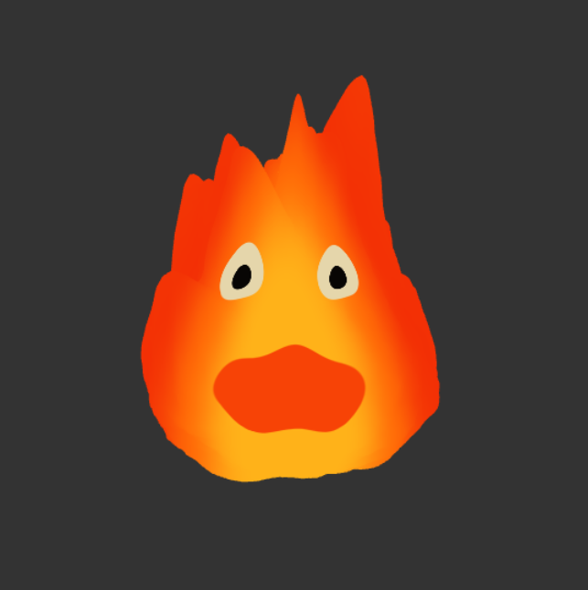
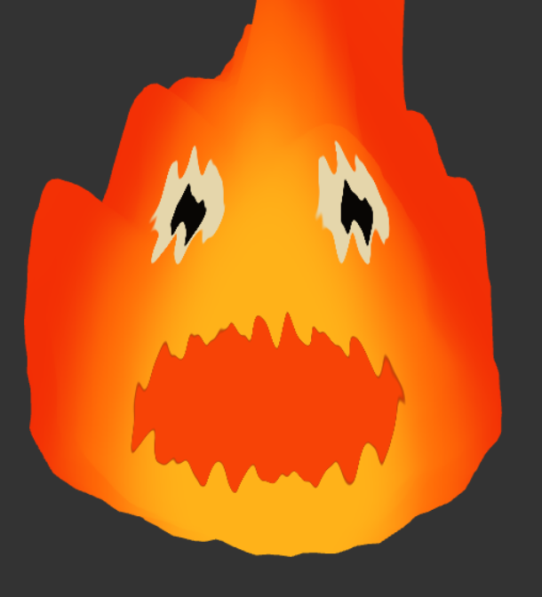

# HW 1: WebGL Fireball

## Live Demo

[Click here to view the live demo]()

## Project Description

For this project, I created an animated fireball using WebGL vertex and fragment shaders. I attempted to recreate Calcifer from Howl's moving castle. 

The basic idea was to deform the icosphere into a tapered flame shape, then create several animated flame tips extending from the upper portion of the mesh. Smaller scale fractal Brownian motion (FBM) was then applied on top of the larger deformation to give the surface additional movement and irregularity.

The fragment shader uses the position and displacement of the surface to create a gradient between yellow, orange, and red. The center and lower portion of the flame are "hotter" and brighter, while the outer and upper regions transition toward darker orange and red.

I wanted the fireball to keep the same general look from the viewer's perspective even as the camera moves around it. This includes both the yellow-orange-red color layout and the face, so the brighter yellow center stays facing the viewer and the facial features do not get stuck on one side of the sphere.

I added the face directly in the fragment shader using procedural masks. The eyes, pupils, and mouth are positioned based on the camera direction so that the face follows the viewer as the camera moves around the fireball. When the camera moves too far above or below the fireball, I reduce this movement so the face and colors do not slide too far toward the top or bottom.

## Final Result

## Shader Features

### Vertex Shader

I utilized the vertex shader for creating the overall shape and movement of the fireball.

**Features:**
- Tapers the original icosphere to create a flame-like silhouette
- Generates multiple flame tips at different angles and heights
- Animates the flame tips over time using sinusoidal motion
- Applies FBM as a higher-frequency layer of surface distortion
- Passes displacement information to the fragment shader for coloring

### Fragment Shader

The fragment shader creates the appearance of the flame and its face.

**Features:**
- Creates a yellow to orange to red gradient
- Uses the position on the fireball to keep the center and bottom "hotter"
- Incorporates vertex displacement into the color calculation
- Procedurally generates the eyes, pupils, and mouth
- Adds small time based movement to the facial features
- Uses the camera direction to keep the face oriented toward the viewer
- Limits this camera-facing behavior when viewing the fireball from far above or below, which prevents the face from sliding unnaturally across the surface

## Interactivity

I created 3 controls for the fireball, along with a way to reset back to my tailored parameters.

- **Caffeine Level** — controls the animation speed
- **Hiccups** — controls the scale of the FBM noise
- **Hair Extensions** — controls how far the flame tips stretch

## Blooper
Just was funny when testing with amplitude for the masks

